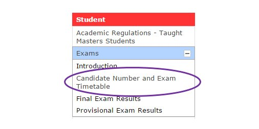

# ST101W Programming for Data Science

## Problem Set 11

### 2023/24 Winter Term

---

Candidate numbers of _all_ group members (NOT the student ID):

- **28077**
- **22076**
- **25489**
- **24410**

Note:

- Candidate numbers are _5-digit_ and you can find on LSEforYou: 

   

---

**!! Please read this README file as it contains important information about the summative problem set !!**

This Problem set consists of 2 programming problems (with Q2 having parts a, b and c):

- Q1. [dna_complement.md](dna_complement.md) (15 marks)
- Q2.
  - [coin_game_part_a.md](coin_game_part_a.md) (15 marks)
  - [coin_game_part_b.md](coin_game_part_b.md) (35 marks)
  - [coin_game_part_c.md](coin_game_part_c.md) (35 marks)

The maximum mark you can get from this problem set is 100.

- **Submission deadline: 11 April 2024 12noon**
  - Any work submitted after the deadline will be penalised
- **Cut-off: 14 April 2024 12noon**
  - No submission will be accepted after the cut-off

**It is a summative assessment and it accounts for 10% of your final grade.** Requests for extensions are only granted in exceptional circumstances. In particular, no extension will be granted for job-related applications, late course add-drop, clash with other coursework, etc.

---

## Submission Procedure

**Your work will only be treated as submitted if you have done all of the following:**

1. Submit your work (`.md`, `.py` and `.ipynb` files) via GitHub

- Note you need to fill your _candidate numbers_ at the top of this md file (NOT student ID!)

2. Submit the `checklist_and_plagiarism_statement.docx` via Moodle

Please read the `Departmental GitHub guidance` on Moodle for further details.

---

## Late Submission Penalty

- For the first 24 hours after the submission deadline:
  - 5% marks will be deducted for every half day (12 hours). This will result in a maximum penalty of 10% marks for the first 24 hours
- For beyond the first 24 hours after the submission deadline, but before the cutoff:
  - 10% marks will be deducted for the first 24 hours as above then 5% marks will be deducted per 24-hour period (not limited to working days)
- For submission after the cut-off
  - Any submission after the cut-off will automatically receive 0 marks

---

## Plagiarism Policy

- Misconduct can lead to a zero for the entire coursework element or more serious consequences
  - Sharing your work with others (except your groupmates for this problem set) also counts as misconduct
- In this course, it is strictly forbidden to use any AI tools such as Chatbot, ChatGPT, Bard, GitHub Copilot in all your coursework
- Your submission must be solely the work of your group. It means that (_unless_ you are told otherwise / you have got permission from the lecturer):

  - All the code must be written by yourself
  - You _cannot_ use
    - Any modules or libraries (unless it is stated otherwise in the question)
      - Even for modules that we have covered like `datetime` and `random`, you are _not_ allowed to use them _unless it is stated otherwise in the question_
        - For Q1, you can use `functools` (but only the function `reduce()`) as stated in the question
        - For Q2, you can use `random`, and the module `coin_game` provided to you as stated in the question
      - Even for libraries that we have mentioned like `NumPy` and `Pandas`, you are _not_ allowed to use them for this problem set
    - Any built-in functions (including methods), types, operators and other functionalities that are _not_ covered or demonstrated in the course, _unless it is stated otherwise in the corresponding question_
      - Even for the things that we have _mentioned_ like `bin()` (it is mentioned because we asked you not to use it for PS2), you are _not_ allowed to use them
      - You are allowed to use the ones that have been _covered_ or _demonstrated_ in the lectures, workshops and problem sets (including the solutions) _unless it is stated otherwise in the question_. The appendix and exercises for self-study are also included
  - You _cannot_
    - Use any AI tools
    - Search for anything related to the coursework _unless it is stated otherwise in the question_. In particular, you must NOT search for answers online
    - Reference to or borrow _any_ materials other than the course materials _provided_ in this iteration (2023/24 Winter Term), except the ones stated in the questions
    - Have any form of communication with your fellow classmates or any other people except the lecturer and your group mates (e.g. fellow classmates, previous students, your parents, someone you pay to help you do the coursework) about the summative work between the release date and the hard deadline. This includes (but does not restrict to):
      - Showing, discussing, viewing, and copying the solution to/from other people
      - Having someone else to do your work
      - Talking about the assignments (including discussing the difficulty levels of the assignments) and your approach to solving them with others

  Please treat the problem set as an examination.

- We take plagiarism seriously. Your code will be checked by some software. Any suspicious plagiarism will be reported for further investigation

If in doubt, always ask the instructor for clarification.

---

## Marking Criteria

| Criteria                     | Details                                                                                                                                                                                                                                    |
| :--------------------------- | :----------------------------------------------------------------------------------------------------------------------------------------------------------------------------------------------------------------------------------------- |
| Sanity                       | Fulfil the required functionality using only the tools allowed in the questions                                                                                                                                                            |
| Problem-solving              | Apply computation thinking to solve problems                                                                                                                                                                                               |
| Programming skills           | Appropriate use of the programming concepts and tools we introduced in the course                                                                                                                                                          |
|                              | Abstraction: every function (including methods), module and class _must_ have an _informative_ and _abstract_ docstring                                                                                                                    |
|                              | Decomposition: use of functions, modules and classes to decompose the problems and facility code reuse (if appropriate)                                                                                                                    |
|                              | Encapsulation: hide the internal data structure                                                                                                                                                                                            |
|                              | Use appropriate programming paradigms (imperative programming, procedural programming, object-oriented programming, functional programming) and the corresponding tools and concepts (e.g. inheritance with polymorphism _if_ appropriate) |
| Program design               | Structure your code and make your code manageable for a relatively complex problem                                                                                                                                                         |
|                              | Easy to maintain - prevent redundant, unnecessary or copy-and-paste code, magic numbers and using global variables inside a function when it is not necessary, etc.                                                                        |
|                              | _Clear_ logic (unless it is _necessary_ to sacrifice it for the sake of quicker computation or storage)                                                                                                                                    |
| Readability                  | Good variable, function, module and class names                                                                                                                                                                                            |
|                              | Appropriate comments _if helpful_, no confusing whitespace, etc.                                                                                                                                                                           |
| Testing                      | Appropriate use of testing to make sure the code works as intended                                                                                                                                                                         |
|                              | Good choice of test cases following the guidance provided in the course                                                                                                                                                                    |
|                              | Automate tests via assertion with good error messages                                                                                                                                                                                      |
| Efficiency                   | Speed of the program; prevent unnecessary repetitive calculations (unless it is stated otherwise in the question)                                                                                                                          |
| Style and good practices     | Following the convention we use in this course, including the naming convention for variables, functions, modules and classes, and indentation                                                                                             |
|                              | Prevent using built-in function names as variable names                                                                                                                                                                                    |
|                              | No unnecessary code, for example, comment-out code, unnecessary printouts, etc                                                                                                                                                             |
| Discussion                   | Sensible discussion of the program results                                                                                                                                                                                                 |
| Good use of Jupyter Notebook | Markdown cell for text and code cell for code. Results must be shown in the Jupyter Notebook                                                                                                                                               |

Your work is expected to show the following characteristics below to get the corresponding mark:

| Mark   | Characteristics                                                                                                                                                          |
| :----- | :----------------------------------------------------------------------------------------------------------------------------------------------------------------------- |
| 70-100 | Excellent understanding of course materials: appropriate and effective use of the tools introduced in the course                                                         |
|        | Excellent programming and problem-solving skills: code executes and solves the given problems (nearly) perfectly, although there may be some minor issues                |
|        | Good readability, style and practice, with excellent program design                                                                                                      |
|        | Good discussion and good use of Jupyter Notebook                                                                                                                         |
|        | Good testing following the guidance of the course                                                                                                                        |
| 60-69  | Good understanding of course materials: appropriate use of the tools introduced in the course                                                                            |
|        | Good programming and problem-solving skills: a large majority of the code executes and solves the questions correctly                                                    |
|        | Good readability, style and practice, with good program design                                                                                                           |
|        | Discussion provides some useful insights. Good use of Jupyter Notebook                                                                                                   |
|        | Good testing following the guidance of the course                                                                                                                        |
| 50-59  | Generally good understanding of course materials: appropriate use of the tools introduced in the course                                                                  |
|        | Generally good programming and problem-solving skills: code executes and fulfil the majority of the requirements, showing the ability to solve problems with programming |
|        | Good readability and style, with good program design                                                                                                                     |
|        | Sensible discussion. Good use of Jupyter Notebook                                                                                                                        |
|        | Testing: Sensible testing following the guidance of the course                                                                                                           |
| 40-49  | Basic understanding of course materials: able to use the tools introduced in the course                                                                                  |
|        | Basic programming and acceptable problem-solving skills: code may not run correctly but demonstrates some good understanding of the syntax and concepts                  |
|        | Readability and style: Good effort in getting the right readability and style, etc.                                                                                      |
|        | Discussion: good attempt. Acceptable use of Jupyter Notebook                                                                                                             |
|        | Testing: Good attempt in testing the code following the guidance of the course                                                                                           |
| 0-39   | Poor understanding of course materials: not able to correctly use the tools introduced in the course                                                                     |
|        | Poor programming and problem-solving skills: code does not work, the given problems are not solved and/or demonstrates a lack of knowledge of syntax and concepts        |
|        | Poor readability and style: not showing enough effort to make the code readable, follow the naming convention we use in the course, etc                                  |
|        | Poor discussion: no attempt or not sensible. Not able to update the given notebooks as required                                                                          |
|        | Poor testing: no attempt or testing is not sensible or not working                                                                                                       |

---

## Note

- Autograder is NOT used for this problem set
- If you are not sure about the questions, please use the Moodle forum so that everyone else can know as well. Alternatively, you can directly contact the lecturer
  - Please do not post your logic or any part of your answers on Moodle
