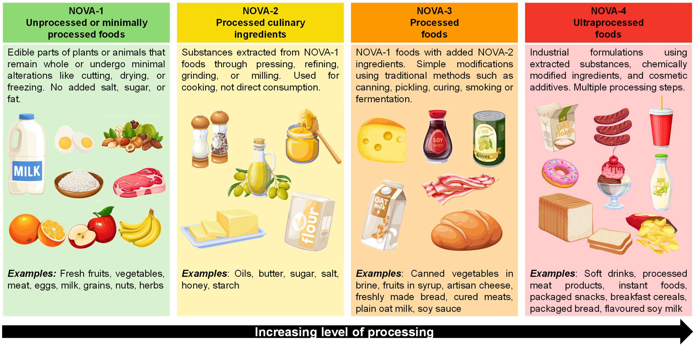
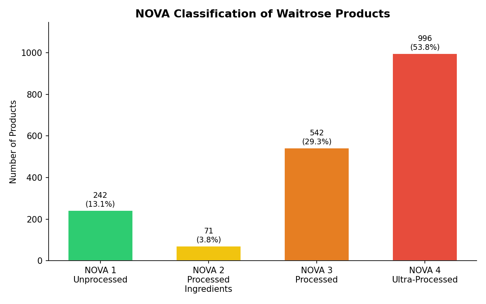
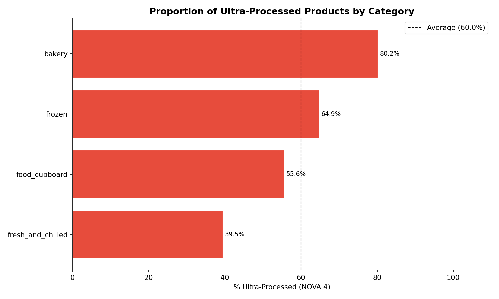
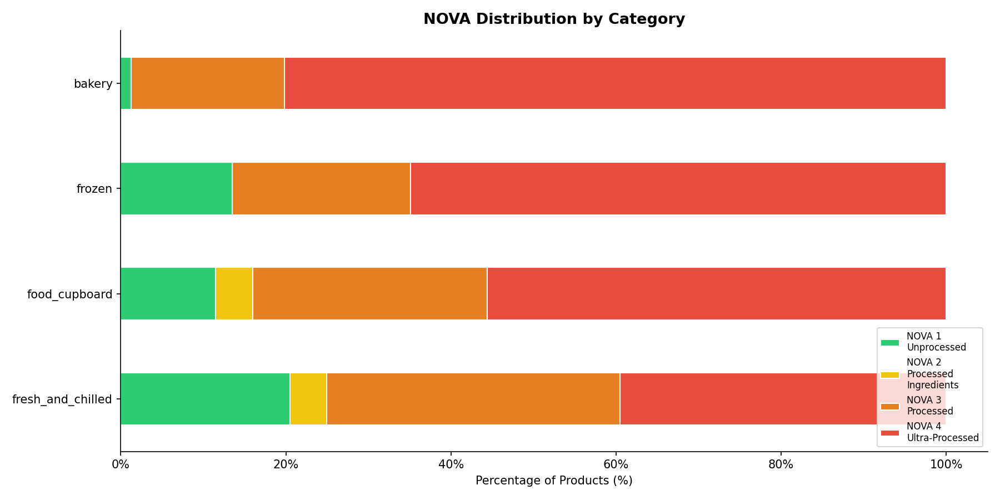
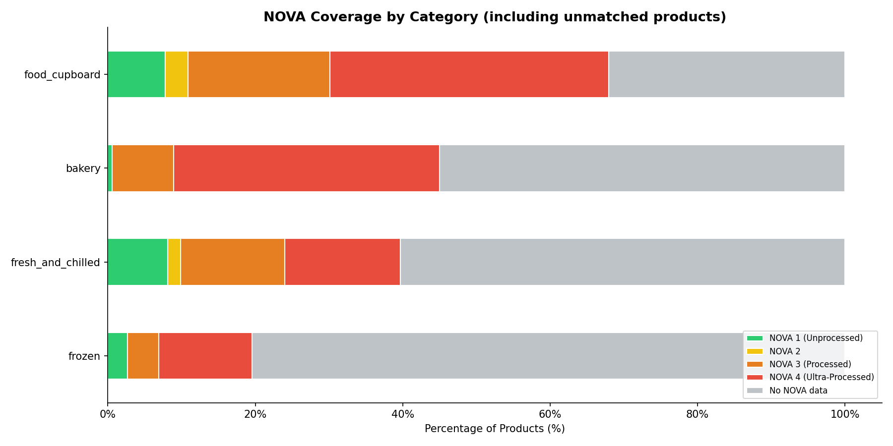

###### DS205: Advanced Data Manipulation
<h1 align="center">Part B: API Development</h1>
<h3 align="center">What Proportion of Groceries and Food Items Available on a UK Supermarket Website is Ultra-Processed (UPF)? And, for Any Given UPF Item, What is its Closest Item That is Non-UPF?</h3>

### API SETUP
This folder contains the API code used to enrich food product data from [Waitrose](https://www.waitrose.com/ecom/shop/browse/groceries) with NOVA classifications,and the implementation of a FastAPI application which serves the enriched product data through structured JSON endpoints. It is organised as follows:
```
api/
├── README.md               # this file
├── data_visualisation.py   # generates graphs used to help answer the overarching questions
├── nova_enrichment.py      # the code used to enrich scraped data with NOVA classifications from OpenFoodFacts
├── models.py               # defines ta Pydantic model that validates and structures data returned by the API
└── main.py                 # the FastAPI application; defines all endpoints and serves the enriched product data
```

### STEP 1: ENRICHMENT WITH NOVA CLASSIFICATIONS


To provide a comprehensive API, Waitrose grocery and food items were enriched with their NOVA classification (see above) from [Open Food Facts (OFF)](https://world.openfoodfacts.org/). This process utilised a two-stage approach:
1. **Barcode Matching**: direct lookup via product barcodes.
2. **Name-Based Fuzzy Matching**: used as a fallback when barcodes are not found in OFF, or are found but without NOVA classification. 
Together, these techniques achieved 56.6% NOVA coverage across 3,657 products, with barcode matching alone providing 50.6%. This stage was ultimately disabled in the final pipeline for two reasons: (1) the search endpoint is rate-limited to 10 requests/minute, making it impractical at scale, and (2) testing showed it did not meaningfully improve NOVA coverage (an increase of 6.6%). It would have added significant runtime complexity without demonstrable benefit, so the code is available to be viewed, but is not included.

The remaining products without a match either lack NOVA data in the OFF database, or could not be matched with barcode alone (products which had a barcode listed on OFF without NOVA classification accounted for 28.6% of products, with 20.8% of barcodes not being in OFF).

#### HOW TO ACCESS ENRICHED DATA
`nova_enrichment.py` outputs two files: 
* `all_products_nova.jsonl` contains the raw data with `nova_group`, an integer variable which takes the values 1-4, or None. 
* `openfoodfacts_cache.json` avoids redundant API calls and respects OFF's rate limits, disk-based caching system was implemented and all API responses are stored here, keyed by barcode for product lookups and by a `name:` prefix for name searches. It is flushed to disk every 50 products, ensuring progress is preserved, and is excluded from this repository due to file size.
```
<this-github-repo>/
├── scraper/
├── api/   
└── data/            
  └── scraped/
  └── enriched/
    └── all_products_nova.jsonl    
    └── openfoodfacts_cache.json   # available if `nova_enrichment.py` is run.
```

#### HOW TO RUN THE ENRICHMENT CODE
With an activated `environment.yml` (see [this README.md](https://github.com/lse-ds205/problem-set-1-sanjanathomas10/blob/main/README.md)), the following commands should be run in the terminal:
```
cd api
python nova_enrichment.py
```

### STEP 2: API DEVELOPMENT
#### HOW TO RUN THE API
With an activated `environment.yml` (see [this README.md](https://github.com/lse-ds205/problem-set-1-sanjanathomas10/blob/main/README.md)), the following commands should be run in the terminal:
```
cd api
uvicorn main:app --reload
```

#### HOW TO ACCESS THE API
Once running, the API can be accessed at:
- **Interactive Documentation**: `http://127.0.0.1:8000/docs`
- **Raw API** (for direct requests): `http://127.0.0.1:8000` — 

#### ENDPOINTS
1. `GET /products` returns all Waitrose products. It accepts an optional `?nova_group=` query parameter to filter by NOVA group.
1. `GET /products/{id}` returns a single product by its Waitrose `product_ID`, including its NOVA group where available.
3. `GET /products/{id}/alternatives` returns returns the top 3 closest less-processed alternatives by name similarity, prioritising NOVA 1 before falling back to NOVA 2 and 3, with the original product identified by its Waitrose `product_ID`.

These endpoints use `product_ID` as the identifier as every product has one, unlike barcodes, or names which are not always unique. It is stored in the URL (for https://www.waitrose.com/ecom/products/waitrose-nduja-sausage-ravioli/565121-793236-793237, it is 565121).

### ANSWERING THE OVERALL QUESTIONS
#### What Proportion of Groceries and Food Items Available on a UK Supermarket Website is Ultra-Processed (UPF)? 
This analysis directly concerns the grocery and food items available from Waitrose. The proportion of UPFs offered at Waitrose across the Bakery, Frozen, Food Cupboard, and Fresh & Chilled categories is greater than non-processed food options:



The average figure (60.0%) is not dissimilar from the average proportion of UPF in diets: The BBC reported that "over half the calories in people's diets come from ultra-processed foods, and they are becoming increasingly common around the world"[^2]. Therefore, the foods offered by Waitrose could be said to simply reflect the UK's eating habits. Overall, emerging research highlights that not all UPFs are bad, but instead show that some nutrient-dense foods with UPF characteristics may be neutral or even beneficial to health[^3]. 



Across each category, the proportion of grocery and food items varies greatly. In gaining NOVA classification data from OFF, one must ask whether their reporting tends to skew in favour of reporting processed foods. As raw fruits, vegetables, and fresh meat are underrepresented in OFF, a primarily a packaged goods database, products without NOVA classifications are disproportionately concentrated in the Fresh & Chilled category. These graphs should therefore be interpreted with caution, as they reflect only products successfully matched to OFF, and may overstate the proportion of ultra-processed foods in Waitrose's overall range.

 

#### And, for Any Given UPF Item, What is its Closest Item That is Non-UPF?
This question is answered through the third endpoint. If a user inputs a product by its Waitrose `product_id`, it returns its closest non-UPF match, unless it is unprocessed itself. It displays an output similar to the following.

### FURTHER DEVELOPMENT
Given the time restriction of this task, there are many ways in which this project could be improved. 

Firstly, through caching, this project was able to better respect the rate limits imposed by OFF, but an alternative method would be to register for an API key, which provides more control over requests, potentially higher rate limits, and better identification of the client to the server. As I faced a low matching rate due to timeout errors (`HTTPSConnectionPool(host='world.openfoodfacts.org', port=443): Read timed out.`), alternative methods (rather than manually adjusting `time.sleep()` and `timeout = x`) could handle failures more gracefully , reducing the number of permanently uncached barcodes due to connection drops.

Secondly, the Fresh & Chilled category contains inherently unprocessed products (raw fruit, vegetables, fresh meat) that have little or no presence in OFF. These products could have been assigned NOVA 1 classifications programmatically based on their Waitrose category and product name — for example, any product in the Fresh & Chilled category whose name contains keywords like "fresh", "raw", or a known fruit or vegetable could be confidently classified as NOVA 1 without an API lookup. This would meaningfully improve coverage for this category. Additionally, products with the same name (e.g. KP Salted Peanuts) that come in multiple sizes, but are the same product could share NOVA classification if one size has one listed on OFF, but a this different size does not.

Finally, name-based fuzzy matching was implemented but disabled due to the search endpoint's 10 req/min rate limit. Using the aforementioned API key or by batching requests across multiple sessions, this could be reintroduced. Alternatively, a more sophisticated matching approach could improve match quality for products with non-standard naming conventions, where token_set_ratio performs poorly. Additionally, contributing missing NOVA classifications back to OFF would improve coverage for future users and would be a meaningful open-source contribution, and this is accessible through registering for an API key as well.

[^1]: https://github.com/seatgeek/thefuzz
[^2]: https://www.bbc.co.uk/food/articles/what_is_ultra-processed_food#:~:text=Ultra%2Dprocessed%20foods%20(UPFs),greater%20risk%20of%20dying%20early.
[^3]: https://www.ahajournals.org/doi/10.1161/CIR.0000000000001365

